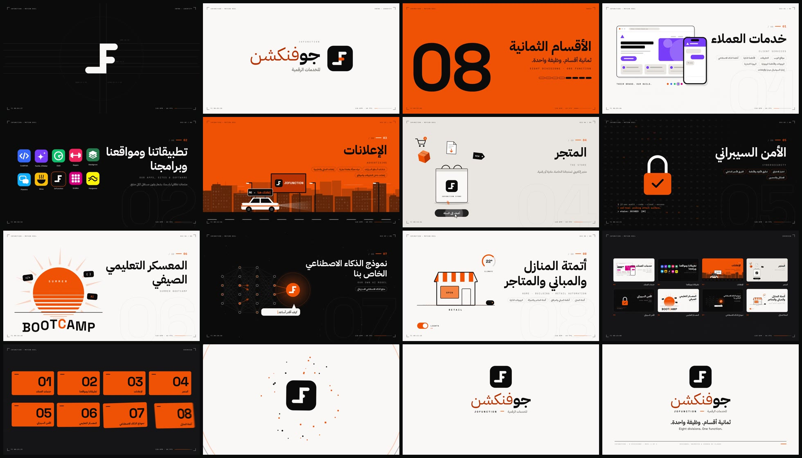

# JoFunction — Motion Reel

A 30-second motion-design showreel built entirely in the JoFunction brand system
(ink `#0B0B0C`, paper `#FAF8F6`, orange `#FF5C00` / `#C43D00`, Space Grotesk +
IBM Plex Sans / Mono / Arabic, and the J/F monogram). It walks through all eight
divisions from the brand sheet. Every shot uses a different motion technique,
and every hit is locked to an original 128 BPM score.

**Watch:** [`out/jofunction-motion-reel.mp4`](out/jofunction-motion-reel.mp4) · 1920×1080 · 60 fps · H.264 + AAC · 30.0 s



## Beat map

30 s = 64 beats = 16 bars at 128 BPM. Every cut, hit and transition sits on this grid.

| Bars | Time | Shot | Technique |
|---|---|---|---|
| 0 | 0.0–1.9 s | Cold open: pulse dot + slate | sonar rings, typewriter, squash & stretch hop |
| 1 | 1.9–3.8 s | Monogram construction | four bars shoot in on the beat over a live construction grid (guides, cap circles, dimensions) |
| 2 | 3.8–5.6 s | Icon + Arabic lockup | the ink world collapses into the app icon; RTL wordmark wipe; zoom-through into the orange bar |
| 3 | 5.6–7.5 s | "08" index / build | slot-machine counter, 16th-note loading pills, collapse to a point |
| 4 | 7.5–9.4 s | 01 Client Services | stroke draw-on UI, staggered pop-ins, live client re-skins ("Their brand. Our build.") |
| 5 | 9.4–11.3 s | 02 Our Products | ten brand marks spring-flip in, glint sweep, house-brand focus ring |
| 6 | 11.3–13.1 s | 03 Advertising | 3-layer parallax city, car-top LED marquee, split-flap billboard |
| 7 | 13.1–15.0 s | 04 The Store | gravity drop + squash, product burst arcs, add-to-cart micro-interaction |
| 8 | 15.0–16.9 s | 05 Cybersecurity | glitch cut, hex field, scan line, lock clamp → keyhole morphs to a check |
| 9 | 16.9–18.8 s | 06 Summer Bootcamp | retro sun with scrolling stripes, bounce-in kinetic type |
| 10 | 18.8–20.6 s | 07 Our AI Model | neural net draw-on, signal pulses, orb, typed Arabic reply |
| 11 | 20.6–22.5 s | 08 Automation | outline draws on, then morphs house → building → store; smart toggle, dial, robot |
| 12–13 | 22.5–26.3 s | Overview wall | pull back from 08 into a wall of all eight live scenes, 8th-note card flips, converge |
| 14–15 | 26.3–30.0 s | End card | impact + shockwave + confetti, glyph rebuild, wordmark, tagline, footer from the brand sheet |

The transitions between divisions are all different: iris, alternating blinds, layered diagonal wipe,
brand-pill expand, glitch slices, a sunrise iris, a halftone dissolve and an iris out of the AI orb.
The picture uses true motion blur, with 4 sub-frames per frame at a 180° shutter.

## Score

The soundtrack is synthesized from scratch in Web Audio (`js/audio.js`). It has no samples.
It runs in A minor and resolves to C major on the end card, and its sonic logo is E–A–C–E,
played as the four monogram bars land and again in C major at the end. Kick, clap, hats, an
offbeat bass, sidechained pads, a delay-throw arp, risers, whooshes and impacts are all scheduled
on the same beat grid as the picture. The mix is normalised to −14 LUFS with a −1 dBFS ceiling.

## Run it

```bash
npm install && npx playwright install chromium   # only needed for rendering
npm run serve          # then open http://localhost:8080 — interactive player with sound, scrubber, space to play
npm run render         # → out/jofunction-motion-reel.mp4 (4 parallel workers, ~3–4 min)
npm run stills -- out/stills 3.4 9.1 24   # full-res stills at given seconds
```

The page has to be served over HTTP so the local fonts load. Rendering needs `ffmpeg` on the PATH.

## Structure

```
index.html        player shell (?capture → bare 1920×1080 canvas for the renderer)
js/core.js        timeline engine, easing, transitions, motion blur, HUD, monogram geometry
js/scenes.js      every shot, written in beats
js/audio.js       the score
js/main.js        player + capture hooks
tools/render.cjs  offline render: score → loudness → frames → ffmpeg segments → MP4
fonts/            Space Grotesk, IBM Plex Sans / Mono / Sans Arabic (SIL OFL)
```

Everything is a pure function of time, so the live player and the export are frame-identical.
